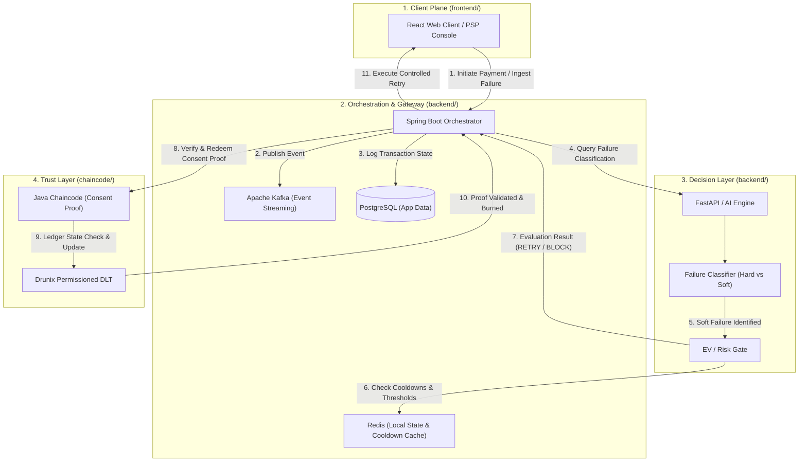

# BharatSetu System Architecture Specification

> **Project:** BharatSetu (भारतसेतु)  
> **Challenge:** Drunix Hackathon in collaboration with Citi  
> **Topic:** Real-Time Payments — Trusted Retry Ledger  
> **Target Repository:** [BharatSetu](https://github.com/Harsh9945/BharatSetu)

---

## 📌 Architectural Overview

BharatSetu introduces a **permissioned, cross-organization Trusted Retry Ledger** built on **Drunix**. It connects Merchant PSPs, Issuing Banks, and payment switches to coordinate autonomous payment recovery for **soft failures** without storing, exposing, or replaying sensitive credentials (PINs, OTPs, CVVs).

The platform separates responsibilities into three major tiers:
1. **Decision Layer:** FastAPI (Python) AI Engine — Classifies failure types (Soft vs. Hard) and evaluates Expected Value (EV) / Risk rules.
2. **Trust Layer:** Drunix Distributed Ledger with Java Chaincode — Manages time-bound, single-use cryptographically verifiable Consent Proofs.
3. **Orchestration Layer:** Spring Boot — Handles payment workflow coordination, event streaming via Kafka, local caching via Redis, and application storage via PostgreSQL.

---

## 🔄 System Flow & Component Interaction

---

## 🧱 Component & Technology Table

| Layer / Component | Technology | Directory | Responsibility & Details |
| :--- | :--- | :--- | :--- |
| **Trust Layer** | **Drunix & Java Chaincode** | `chaincode/` | Permissioned distributed ledger platform running Java chaincode. Stores cryptographically verifiable, time-bound, and single-use **Consent Proofs** for transaction recovery without exposing auth secrets. |
| **Decision Layer** | **FastAPI (Python)** | `backend/` | Microservice hosting the **AI Payment Failure Classifier** (categorizes soft vs. hard failures) and the **EV / Risk Gate** (evaluates cooldowns, value thresholds, and max retries). |
| **Orchestration Layer** | **Spring Boot** | `backend/` | Core payment orchestrator and gateway. Manages transaction lifecycle, coordinates decisions between the AI engine and Drunix ledger, and triggers payment retries. |
| **Event Streaming** | **Apache Kafka** | Infrastructure | Real-time event bus capturing payment attempts, failure signals, retry events, and ledger state updates across participating organizations. |
| **Local State & Cache** | **Redis** | Infrastructure | In-memory cache for fast policy verification, active retry cooldown timers, and transient failure counts. |
| **Application Persistence**| **PostgreSQL** | Infrastructure | Relational data store for audit logs, historical transaction metadata, organization profiles, and system analytics. |
| **Frontend UI** | **React** | `frontend/` | Web dashboard for payment status tracking, retry policy configuration, and real-time ledger auditability. |
| **Infrastructure** | **Docker / Compose** | Infrastructure | Orchestrates local development containers including Drunix test network, Kafka, Redis, Postgres, FastAPI, and Spring Boot. |

---

## 🔒 Security & Consent Proof Lifecycle

1. **Non-Storage of Credentials:** Neither PINs, OTPs, CVVs, nor authentication secrets are ever stored or logged on Drunix or the backend services.
2. **Proof Issuance:** Successful initial authentication generates a time-bound hash proof recorded on the Drunix permissioned ledger.
3. **Single-Use Burn:** Upon successful execution of a controlled retry, the Java chaincode updates the proof state to `REDEEMED`, permanently blocking re-use.
4. **Cross-Organizational Auditability:** Member organizations (Issuing Banks, PSPs, Switches) verify consent proof validity directly against Drunix peers.
