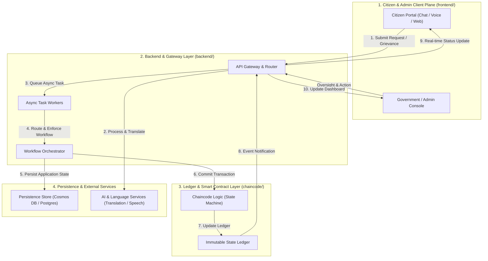

# BharatSetu Architecture Specification

> **Document Version:** 1.0.0 (Proposal Stage)  
> **Target Repository:** [BharatSetu](https://github.com/Harsh9945/BharatSetu)

---

## 📌 Executive Summary

BharatSetu is designed as a resilient, decoupled civic infrastructure and trade orchestration platform. The architecture ensures that user requests (grievances, trade transactions, service applications) are enriched, routed, persistently logged, and verified via decentralized smart contracts without relying on transient single-session states.

---

## 🔄 Architectural Flow Diagram

---

## 🧱 Component Architecture Table

| Component Layer | Directory | Key Elements | Responsibility & Description |
| :--- | :--- | :--- | :--- |
| **Citizen & Admin Plane** | `frontend/` | Next.js Client, Web & Mobile UI, Voice/Chat Ingestion | User-facing portal for submitting requests, filing grievances, uploading documents, and real-time tracking. Includes administrator oversight dashboard. |
| **Backend & Routing Gateway** | `backend/` | API Gateway, Routing Engine, Async Worker Queues | Ingests requests, performs authentication, manages background tasks, orchestrates multi-step workflows, and integrates AI translation services. |
| **Smart Contract Layer** | `chaincode/` | Chaincode Contracts, Ledger Verification, State Transition Rules | Decentralized logic enforcing immutable transaction records, multi-party approval state machines, and tamper-proof audit trails. |
| **Persistence & External Services** | Infrastructure | Relational / Document Store, AI Speech/Vision, Azure/AWS Cloud | Maintains operational persistent state (user profiles, message logs, document metadata) alongside external language translation and vision models. |

---

## 🔒 Security & Data Integrity

1. **Immutability:** Transaction states and official actions are recorded via `chaincode/` onto a distributed ledger.
2. **Persistence:** Asynchronous workers ensure that requests are never dropped during transient gateway downtime or long-running administrative processes.
3. **Multi-lingual Accessibility:** Language processing happens at the gateway layer before state submission, normalizing requests across regional dialects.
