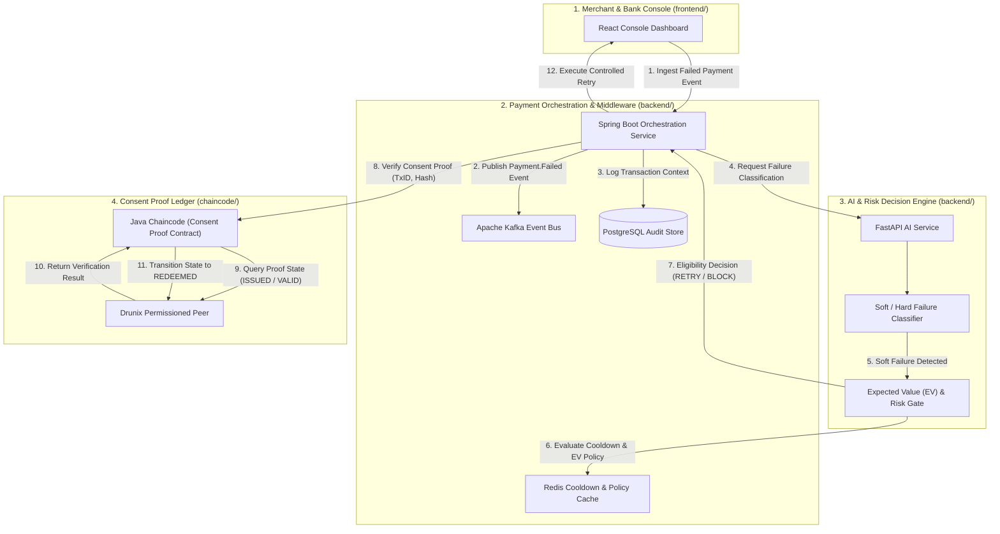
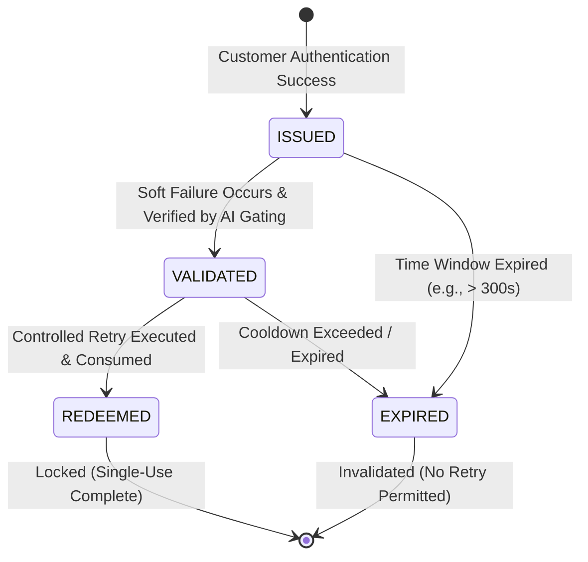

# BharatSetu Architecture & Technical Specification

> **Project:** BharatSetu (भारतसेतु)  
> **Challenge:** Drunix Hackathon in collaboration with Citi  
> **Topic:** Real-Time Payments — Trusted Retry Ledger  
> **Target Repository:** [BharatSetu](https://github.com/Harsh9945/BharatSetu)

---

## 📌 1. Executive Summary & Problem Scope

In real-time payment systems (e.g., UPI, card networks, instant bank transfers), payment attempts frequently fail due to **soft failures** — transient network timeouts, gateway errors, or temporary payment-switch disruptions. Unlike **hard failures** (e.g., insufficient funds, invalid account details, fraud blocks), soft failures represent legitimate transactions that could succeed on retry.

However, executing retries across organizational boundaries (Merchant PSP ↔ Payment Switch ↔ Issuing Bank) introduces significant security and trust challenges:
- **Credential Protection:** Retries must **never** store, expose, or replay customer authentication secrets (PINs, OTPs, CVVs).
- **Single-Use Authorization:** A retry must be strictly authorized based on prior valid authentication, but must be single-use to prevent replay attacks.
- **Cross-Organization Verification:** Merchant PSPs and Issuing Banks require an independent, immutable ledger to verify retry eligibility without disclosing internal system states.

**BharatSetu** addresses this challenge by deploying a **Drunix Permissioned Distributed Ledger** running **Java Chaincode** alongside a **FastAPI AI Decision Engine** and **Spring Boot Orchestrator**.

---

## 🔄 2. End-to-End System Interaction

---

## 🔐 3. Consent Proof Lifecycle State Machine

When a customer successfully authenticates during an initial payment attempt, a cryptographically signed, time-bound **Consent Proof** token is generated and recorded on the Drunix ledger.

### State Definitions
- **`ISSUED`**: Generated upon successful customer authentication. Contains hashed authorization context, expiration timestamp, and transaction ID.
- **`VALIDATED`**: Evaluated by the FastAPI AI Failure Classifier and EV/Risk Gate as eligible for soft-failure recovery.
- **`REDEEMED`**: Consumed during the controlled retry attempt. Burned on Drunix Java Chaincode to prevent double-spending or replay attacks.
- **`EXPIRED`**: Proof time-to-live (TTL) exceeded. Hard-blocked from future retries.

---

## 🧱 4. Component Architecture & Technology Stack

| Layer | Sub-Component | Technology | Directory | Description & Responsibilities |
| :--- | :--- | :--- | :--- | :--- |
| **Trust Layer** | Consent Proof Contract | **Drunix & Java Chaincode** | `chaincode/` | Permissioned DLT executing Java smart contracts. Maintains immutable consent proof lifecycle (`ISSUED`, `VALIDATED`, `REDEEMED`, `EXPIRED`) and cross-org verification. |
| **Decision Layer** | Failure Classifier & EV Gate | **FastAPI (Python)** | `backend/` | Microservice analyzing payment failure responses (e.g., HTTP 504 timeouts, switch disconnects vs. 401 unauth / 402 low funds) and calculating Expected Value (EV) retry risk score. |
| **Orchestration Layer** | Payment Engine | **Spring Boot** | `backend/` | Core backend service routing events, orchestrating retry execution, and interfacing with Drunix Java Chaincode SDK. |
| **Event Streaming** | Message Bus | **Apache Kafka** | Infrastructure | Real-time event broker for `Payment.Attempted`, `Payment.Failed`, `Proof.Issued`, `Proof.Redeemed`, and `Retry.Executed` events. |
| **State & Cache** | Cooldown Cache | **Redis** | Infrastructure | High-speed cache tracking active retry cooldown windows, velocity limits, and transient error counts. |
| **Persistence** | Operational Store | **PostgreSQL** | Infrastructure | Relational storage for transaction history, audit trails, organization PSP keys, and analytical reporting. |
| **Client UI** | Management Console | **React** | `frontend/` | Web UI for Merchant PSPs and Issuing Banks to inspect real-time transaction failures, retry statuses, and Drunix ledger audit logs. |
| **Infrastructure** | Environment Setup | **Docker & Compose** | Infrastructure | Multi-container environment running local Drunix test network, Kafka, Redis, Postgres, FastAPI, and Spring Boot. |

---

## 🛡️ 5. Security & Zero-Credential Replay Guarantees

1. **Zero Auth Secret Storage:** PINs, OTPs, CVVs, and raw authentication tokens are **never** written to Drunix, database storage, logs, or cache layers.
2. **Cryptographic Proof Hashing:** Consent proofs consist solely of `SHA-256(TxID + OrgID + Timestamp + Nonce)` signed by the authorizing participant.
3. **Single-Use Enforcer:** Drunix Java Chaincode atomically updates state to `REDEEMED` during retry validation, guaranteeing zero replay attacks.
4. **Cross-Organization Auditability:** All participating banks and PSPs hold peer nodes on the Drunix network for independent ledger verification.
